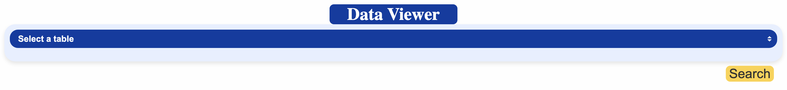
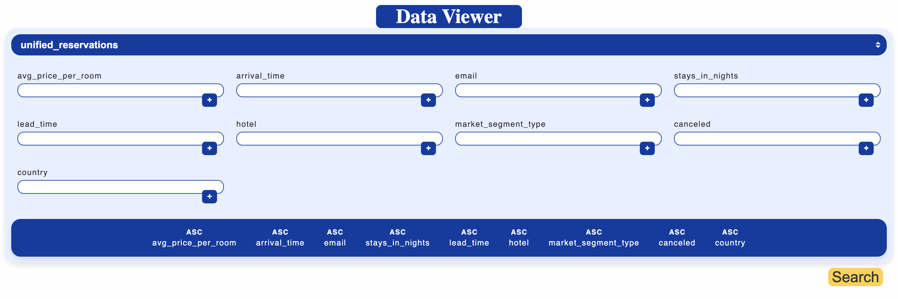
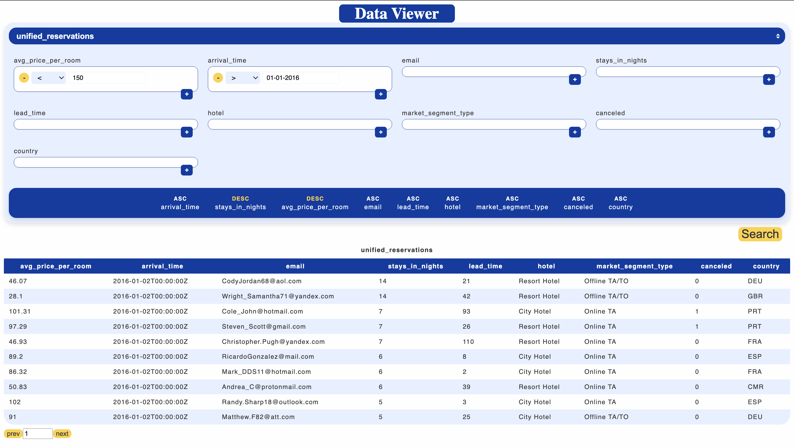

# Phase 3: WebUI for Searching and Filtering

The web UI is a web page that has widgets for displaying filtered rows of tables in the database that was built in [Phase 2](/phase-2/).

## Functionality

The web page, when first loaded, allows the user to select a table from the database.

After selecting a table, the query builder is displayed for the user which allows him to place constraints on the table to filter out rows.
Additionally, the bottom row of field names may be reordered by dragging and dropping to determine the ordering precedence, with the leftmost being the main orderer, with ties being broken by looking at the second, third, et cetera. If one of the field names on the bottom row is clicked, it is toggled between ascending and descending.

After placing constraints on the rows of the table, the "Search" button will trigger the first page of the returned relation. Underneath the displayed relation lies a pagination menu, wherein the previous page and next page buttons can navigate between pages in the returned relation or the desired page number can be entered manually.

## Getting It Running

### Database

The web server requires a Postgres database to be running to function.
A Postgres database can be started in a Docker container using [../start_postgres.bash](../start_postgres.bash), which is in the root directory of this repository. Note that the bash script must be run from the [root directory](/) of the entire repository This database will initialize with three tables: one for either of the tables provided for the assignment and one for the unified dataset.

### Compilation
The web server must be compiled with the [Go](https://go.dev/).
To compile the source code, use `go build -o web-server` from inside this directory, i.e. the directory with this `README.md`.
The output of compilation is a single executable binary file.

### Execution

The web server, after compilation, can be run via the generated executable.
The executable has some keyword arguments that can be inspected with `./web-server -h`.
Importantly, the connection information for the Postgres database must be specified via the keyword arguments.

## Implementation
### Tech Stack
The web UI is implemented as a web server written in Go,
using the typical HTML, CSS, and JavaScript front-end stack.

The static files, including the front-end source documents,
are compiled into the binary.

The web server depends on an externally run Postgres database.

### Web Endpoints

There are four core web endpoints used for the web UI into the database.

- GET /static/*file_path*
    -  The static files are hosted at this root URI
- GET /api/tables
    - Responds with the names of all tables in the database alongside the corresponding field names and data types.
- POST /api/query
    - Receives a json-formatted query, using the format described in [server/static/js/db_api.js](server/static/js/db_api.js), and responds with rows that satisfy the query.
- GET /
    - Responds with the web page containing the database-search UI.

### Software Architecture

The Go programming language has a robust standard library for web development and is also compiled,
leading to a maintainable and performant code repository.

Both the web server and the web UI use database reflection for determining the available tables and the names and types of the columns.
This means that both the front- and back-end code have behavior determined by the schemata of the tables present in the database.
This makes the database the single source of truth, leaving out the need to specify in the database schemata in the database, web server, and web UI separately.
Reflection, proving thus a single source of truth, facilitates changes to the DB architecture without having to modify any of this repository's code, either front or back end.

Database reflection is provided to the front end via `GET /api/tables`, which is used by the web components to determine the names and types of columns for all available tables.
For the back end, the reflection is more of a pipeline, where data from the database is transformed into JSON then packaged in an HTML response.

The front-end application was created without the use of an external framework.
In lieu of a framework, JavaScript [Web Components](https://developer.mozilla.org/en-US/docs/Web/API/Web_components) implemented the interactive portions of the web UI. Web Components allow element styling and callbacks to be isolated to each component using shadow DOMs, combating bugs due to styling overriding and clashing callbacks.

After using `GET /api/tables` to get the table information, the front end makes queries by hitting `POST /api/query` with attached JSON data. From hence, the web server parses the data and sends the appropriate SQL statement to the connected database. The web server does not accept arbitrary SQL statements, which prevents attackers from performing illegal actions like deletion. The `POST /api/query` endpoint can only create sideëffectless SQL statements.

## Areas for Improvement

Whereas the web server performs a decent amount of error checking---responding with an error message, for example, if a non-existent field or constraint type is sent to `POST /api/query`---the front end performs almost no error checking.
Therefore, if the web server is not running, the front end application will not gracefully indicate disfunction; however, the front end is designed such that illegal queries should never be constructed.